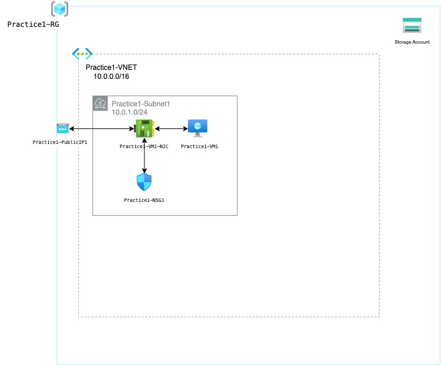

# Practice 1
### Creates the following resources:
### 1 resource group called Practice1-RG
### 1 VNET called Practice1-VNET that is in Practice1-RG
### 1 subnet called Practice1-Subnet1 that is in Practice1-VNET
### 1 VM called Practice1-VM1 that is in Practice1-RG
### 1 network interface called Practice1-VM1-NIC that is attached to Practice1-VM1
### 1 public IP called Practice1-PublicIP1 that is attached to Practice1-VM1-NIC
### 1 network security group called Practice1-NSG1
### 1 storage account with a randomized name

To SSH to the VM from a Mac or Linux shell:
Create the private key file:
terraform output -raw tls_private_key > id_rsa
Set its permissions
chmod 400 id_rsa
ssh -i id_rsa adminuser@Practice1-PublicIP1

.